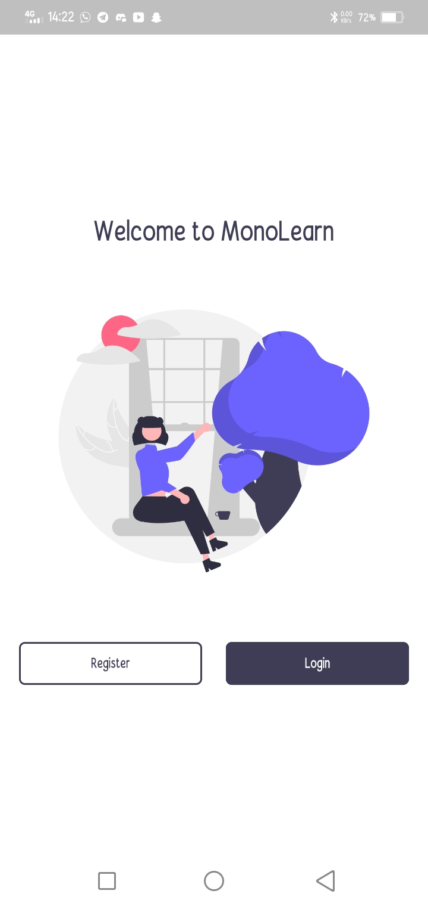
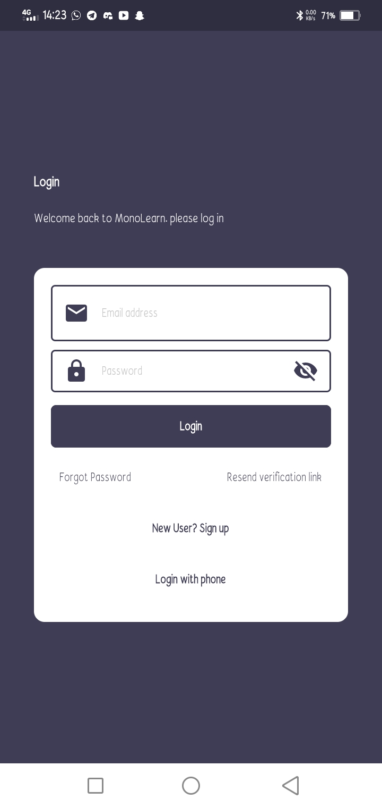
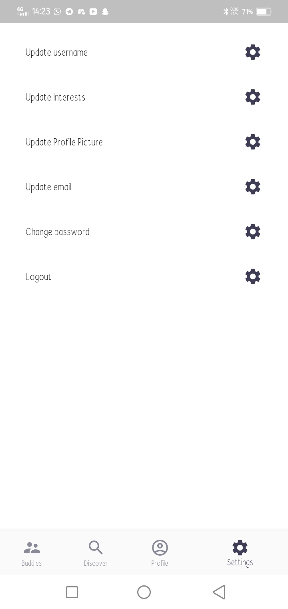
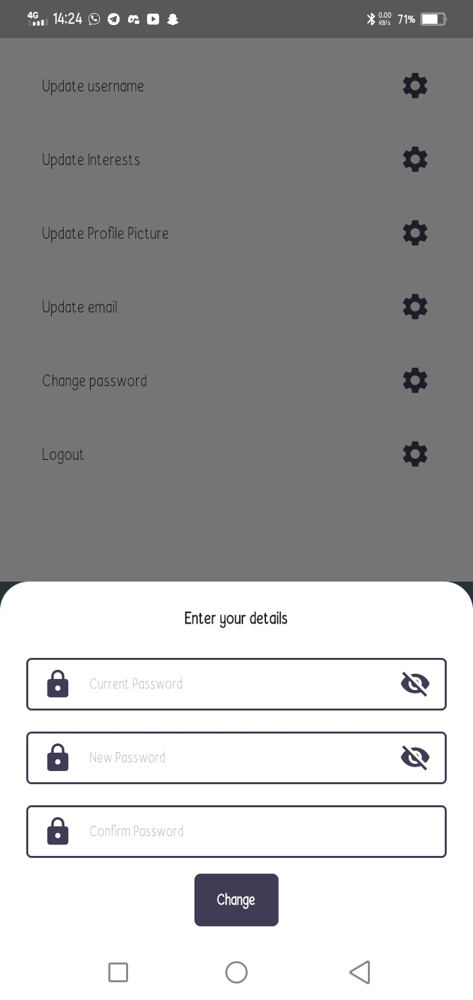

# Monolearn

Monolearn is a platform that makes learning easy and fun. 
The idea of monolearn is to enable users learn basic concepts with ease and get tested as they learn
## Features

The project uses the following

* Firebase Authentication for user registration and authentication,
* Firebase Realtime database,
* Provider for state management.

Users are allowed to:
* Register new accounts after which a verification email is sent to them.
* Login once their email address has been verified.
* Update user details such as: username, password, email, etc.

